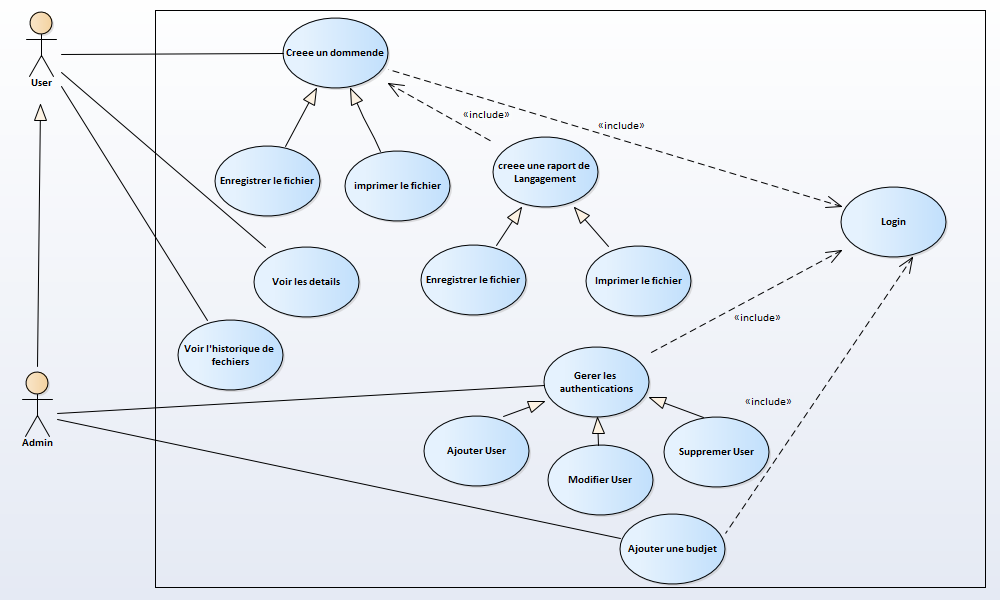
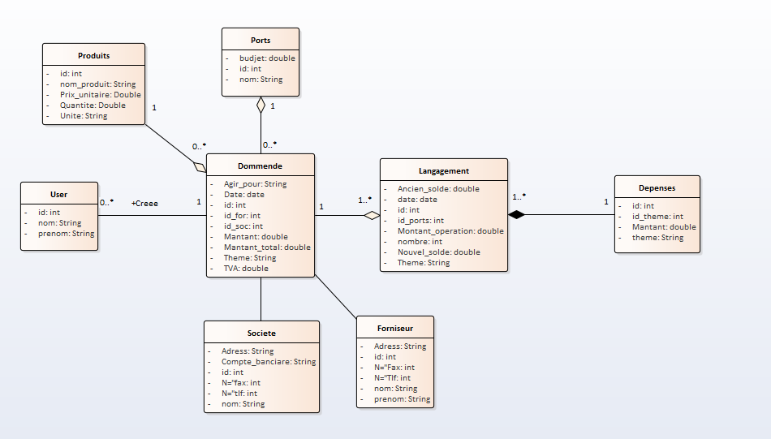
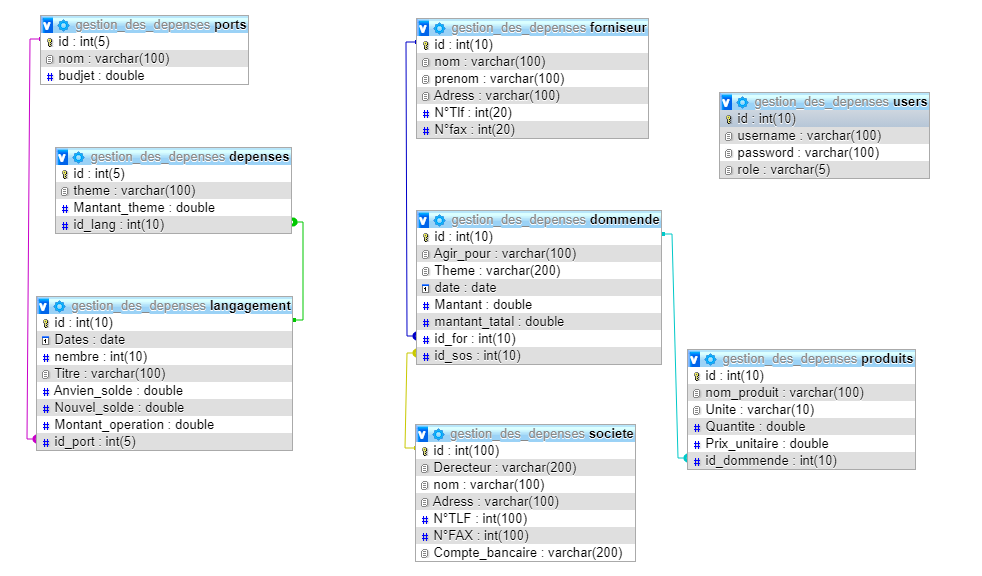
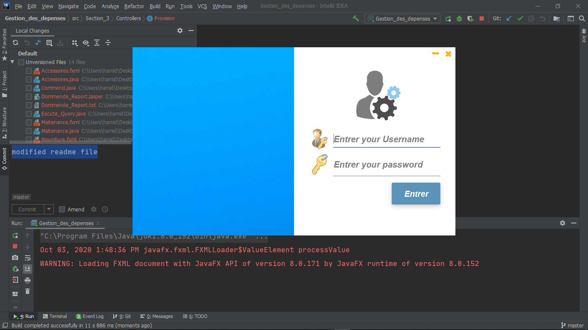

# Gestion_des_depenses
CMS (Content Management System) for depenses management
# Rapport of Gestion_des_depenses work :unlock: :snake:

### :white_check_mark: Our mechanism:
### :camera: Use case diagram
Console (app)          |
:---------------------:|
 |
### :camera: Class diagram
Console (app)          |
:---------------------:|
 |
### :camera: Database
Console (app)          |
:---------------------:|
 |
### :white_check_mark: Screenshots:
### :camera: Login
Console (app)          |
:---------------------:|
 |
